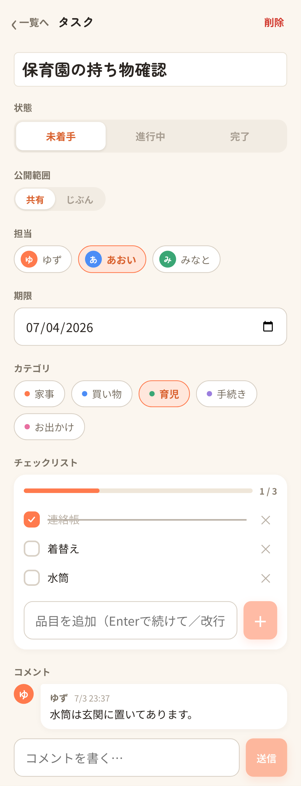

# petabo

家族・友人で共有する TODO + チェックリストアプリです。Cloudflare Workers + Hono + D1 + React + LINE 連携で作った個人開発アプリを、**参考実装**として公開しています。

このリポジトリはそのまま使えるテンプレートではありません。実際の個人プロジェクトの形を残しつつ、本番 URL、実データ、生成デザイン素材など公開に不要な情報は除外しています。

## 機能

- 担当者、期限、カテゴリ、コメント、公開範囲つきの共有 TODO
- 子タスクを持てるチェックリスト
- 作成者だけが見える非公開タスク
- 招待リンクによる家族スペース参加
- LINE ログイン、Messaging API webhook、Flex メッセージ、リッチメニュー、LIFF、期限リマインダー push
- 同一 Worker から配信する PWA フロントエンド
- D1 migration、Vitest、Playwright E2E

## 技術スタック

- フロントエンド: React, TypeScript, Vite, PWA
- バックエンド: Cloudflare Workers, Hono
- DB: Cloudflare D1
- スケジューラ: Cloudflare Workers Cron Triggers
- 認証: D1 保存の HttpOnly Cookie セッション、LINE Login OIDC、フォールバックのパスワード認証
- LINE: Messaging API, Flex メッセージ, リッチメニュー, LIFF

## デザイン

UI の方向性は、実装前に Claude Design で検討しました。その後、React/CSS に落とし込んでいます。

Claude Design が生成した元ファイルは、この公開リポジトリには含めていません。公開しているのは、実装済みのアプリコード、デザイントークン、サンプルスクリーンショットのみです。

## スクリーンショット

すべてサンプルデータです。本番データは含めていません。





## ローカル開発

Node.js 22 以上が必要です。

```bash
npm install
npm run migrate:local
npm run build
npm run dev
```

フロントエンドを HMR で触る場合:

```bash
npm run dev:web
```

主な確認コマンド:

```bash
npm run typecheck
npm test
npm run build
npm run e2e
```

## 環境変数

ローカル開発では `.dev.vars.example` を `.dev.vars` にコピーして使います。

Web/PWA の基本機能だけなら LINE 関連の値は未設定でも動きます。LINE ログイン、webhook、LIFF、push 通知を使う場合は設定が必要です。

本番では Workers Secrets に設定します。

```bash
npx wrangler secret put LINE_CHANNEL_SECRET
npx wrangler secret put LINE_CHANNEL_ACCESS_TOKEN
npx wrangler secret put LINE_LOGIN_CHANNEL_ID
npx wrangler secret put LINE_LOGIN_CHANNEL_SECRET
npx wrangler secret put APP_BASE_URL
npx wrangler secret put LIFF_ID
```

## Cloudflare セットアップ

D1 database を作成し、`wrangler.toml` の `database_id` を自分の値に差し替えます。

```bash
npx wrangler d1 create petabo
npm run migrate:remote
npm run deploy
```

このリポジトリに含まれる `wrangler.toml` の `database_id` は placeholder です。デプロイ前に必ず差し替えてください。

## ドキュメント

- [docs/SPEC.md](docs/SPEC.md): 機能、データモデル、API、認証、LINE 連携
- [docs/ARCHITECTURE.md](docs/ARCHITECTURE.md): 全体アーキテクチャ
- [docs/TESTING.md](docs/TESTING.md): テスト観点
- [docs/LINE_SETUP.md](docs/LINE_SETUP.md): LINE / Cloudflare セットアップ
- [docs/DEPLOY_RUNBOOK.md](docs/DEPLOY_RUNBOOK.md): デプロイと運用手順

## ライセンス

MIT
