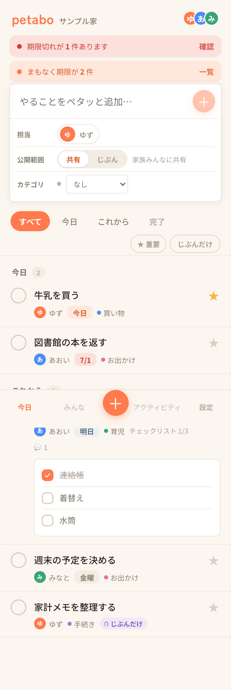

# petabo

petabo is a small family TODO and checklist app built as a reference implementation for Cloudflare Workers, Hono, D1, React, and LINE integration.

This repository is published as a **reference implementation**, not a ready-to-use template. It keeps the shape of an actual personal project, while removing private production details and generated design artifacts.

## Features

- Shared TODOs with assignee, due date, tags, comments, and visibility.
- Checklist tasks with tap-to-complete items and progress display.
- Private tasks visible only to their creator.
- Invite-link based household participation.
- LINE Login, LINE Messaging API webhook commands, Flex messages, rich menu, LIFF, and reminder push notifications.
- PWA frontend served from the same Worker deployment.
- Cloudflare D1 migrations and Vitest/Playwright test coverage.

## Stack

- Frontend: React, TypeScript, Vite, PWA
- Backend: Cloudflare Workers, Hono
- Database: Cloudflare D1
- Scheduler: Cloudflare Workers Cron Triggers
- Auth: HttpOnly Cookie sessions stored in D1, LINE Login OIDC, fallback password auth
- LINE: Messaging API, Flex messages, rich menu, LIFF

## Design Note

The UI direction was first explored with Claude Design, then implemented in React/CSS. The generated Claude Design source artifacts are intentionally not included in this public repository. Only the resulting app code and design tokens are kept.

## Screenshots

Sample data only. No production data is included.




## Local Development

Node.js 22 or later is required.

```bash
npm install
npm run migrate:local
npm run build
npm run dev
```

For frontend HMR:

```bash
npm run dev:web
```

Useful checks:

```bash
npm run typecheck
npm test
npm run build
npm run e2e
```

## Environment

Copy `.dev.vars.example` to `.dev.vars` for local development.

LINE-related values are optional for the Web/PWA core, but required for LINE Login, webhook, LIFF, and push notifications.

Production secrets should be set with Workers Secrets:

```bash
npx wrangler secret put LINE_CHANNEL_SECRET
npx wrangler secret put LINE_CHANNEL_ACCESS_TOKEN
npx wrangler secret put LINE_LOGIN_CHANNEL_ID
npx wrangler secret put LINE_LOGIN_CHANNEL_SECRET
npx wrangler secret put APP_BASE_URL
npx wrangler secret put LIFF_ID
```

## Cloudflare Setup

Create a D1 database and update `wrangler.toml` with your own database id.

```bash
npx wrangler d1 create petabo
npm run migrate:remote
npm run deploy
```

The checked-in `wrangler.toml` uses a placeholder `database_id`; replace it before deploying.

## Documentation

- [docs/SPEC.md](docs/SPEC.md): product scope, data model, APIs, auth, LINE behavior
- [docs/ARCHITECTURE.md](docs/ARCHITECTURE.md): high-level architecture
- [docs/TESTING.md](docs/TESTING.md): testing checklist
- [docs/LINE_SETUP.md](docs/LINE_SETUP.md): LINE and Cloudflare setup notes
- [docs/DEPLOY_RUNBOOK.md](docs/DEPLOY_RUNBOOK.md): deploy and operations runbook

## License

MIT
