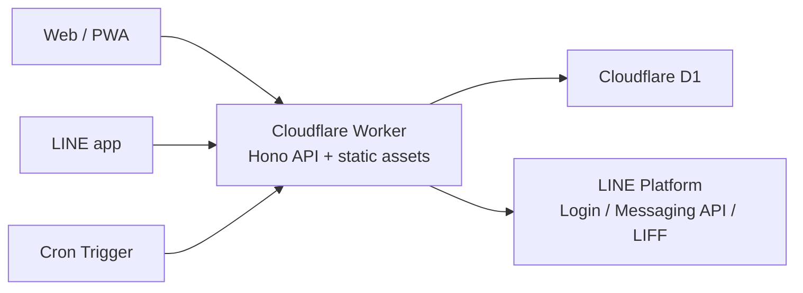

# Architecture

petabo uses a single Cloudflare Worker as the backend and static asset host.

## Why This Shape

- The app is small and family-oriented, so operational cost and maintenance effort should stay low.
- Cloudflare Workers can serve both the API and built frontend assets in one deployment.
- D1 is enough for relational data such as users, households, memberships, todos, checklist items, comments, tags, sessions, and reminder history.
- Cron Triggers can run due-date reminder checks without another scheduler.
- LINE handles the notification surface and lightweight chat operations, while the PWA handles richer editing.

## Runtime Boundaries

- The browser and LIFF frontend only call the app API.
- LINE secrets stay on the Worker side.
- LINE webhook requests are verified from the raw body before JSON parsing.
- Session state is stored in D1 and attached through HttpOnly cookies.
- Private tasks are filtered by creator on the server side, not only in the UI.

## Deployment

The frontend is built into `web/dist` and served through the Worker assets binding. The same Worker also exposes REST routes and scheduled reminder logic.
