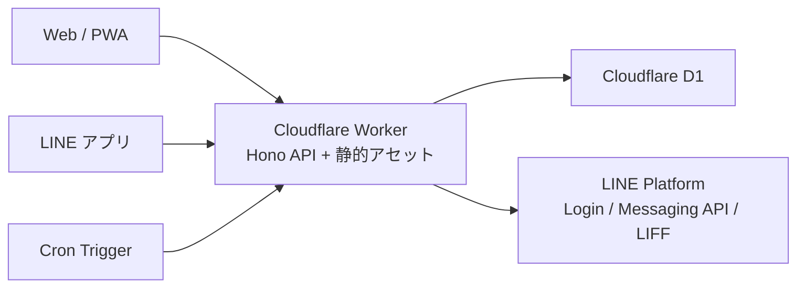

# アーキテクチャ

petabo は、単一の Cloudflare Worker を API サーバー兼 静的アセット配信元として使います。

## この構成にした理由

- 家族向けの小さなアプリなので、運用コストとメンテナンス負荷を低くしたい。
- Cloudflare Workers なら API とビルド済みフロントエンドを 1 デプロイにまとめられる。
- D1 は users、households、memberships、todos、checklist items、comments、tags、sessions、reminder history のような関係データに向いている。
- Cron Triggers で期限リマインダーを別のジョブ基盤なしで動かせる。
- LINE は通知と軽い操作の入口、PWA は詳細編集の入口として役割分担できる。

## 境界

- ブラウザ / LIFF フロントエンドは petabo API だけを呼ぶ。
- LINE の secret や access token は Worker 側に閉じる。
- LINE webhook は raw body で署名検証してから JSON parse する。
- セッションは D1 に保存し、HttpOnly Cookie で扱う。
- 非公開タスクは UI だけでなく、サーバー側で作成者によりフィルタする。

## デプロイ

フロントエンドは `web/dist` にビルドし、Worker の assets binding で配信します。同じ Worker が REST API と scheduled reminder も担当します。
