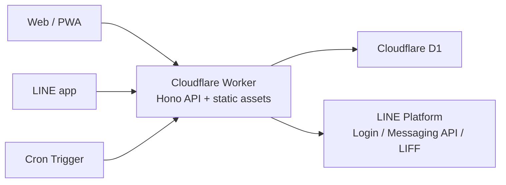

家族で使う共有 TODO アプリ `petabo` を作りました。

ただ作っただけではなく、最初に Claude と壁打ちして要件・制約・アーキテクチャを整理し、Claude Design で UI の方向性を固め、その後 Claude Code で実装する、という流れで進めました。

この記事では、完成したアプリそのものよりも、そこに至るまでの進め方、技術選定の理由、つまずいた点、公開前に整理したことを中心に書きます。

公開したリポジトリはこちらです。

@[card](https://github.com/kinokomilk/petabo)

:::message
公開リポジトリには、本番 URL、実データ、実名、Claude Design の元素材は含めていません。
スクリーンショットもサンプルデータで撮り直しています。
:::

## 作ったもの

`petabo` は、家族・友人で使う共有 TODO + チェックリストアプリです。

主な機能は次の通りです。

- 担当者、期限、カテゴリ、コメント付きの TODO
- タスク内に複数項目を持てるチェックリスト
- 作成者だけが見える非公開タスク
- 招待リンクによる参加
- LINE ログイン
- LINE Messaging API による一覧表示、完了操作、期限リマインダー
- PWA としてスマホから使える Web 画面

家族で使うものなので、細かい管理機能よりも「スマホでさっと追加できる」「通知に気づける」「買い物リストのような子タスクを扱える」ことを優先しました。

ホーム画面は、クイック追加とチェックリストの進捗が見える構成にしています。

タスク詳細では、状態、公開範囲、担当、期限、カテゴリ、チェックリスト、コメントをまとめて編集できます。

LINE からは、一覧、今日のタスク、メモ追加、連携設定へ入れるようにしています。

## いきなり Claude Code で書き始めなかった

今回よかったと思っているのは、いきなり実装に入らなかったことです。

まず Claude と壁打ちして、次のようなことを先に決めました。

- 誰が使うのか
- 何をできる必要があるのか
- 無料枠で運用できるか
- Web と LINE の役割分担
- 認証と通知をどうつなぐか
- 非公開タスクをどう扱うか
- 実装をどのフェーズに分けるか

この段階で「個人開発だけど家族が実際に使う」「ランニングコストは極力ゼロ」「LINE は通知と軽い操作、Web/PWA は詳細操作」という方向性が固まりました。

結果として、Claude Code に渡す時点ではかなり仕様が整理された状態になっていました。

AI コーディングでは、コードを書かせる前に「何を作るか」「何を作らないか」を固める時間がかなり効くと感じました。

## なぜ Cloudflare + React + LINE になったか

アーキテクチャは最初から決め打ちではなく、制約から逆算しました。

一番大きかった制約は、家族向けの小さなアプリなので運用コストを増やしたくないことです。サーバーや DB を別々に持つと、アプリ自体より運用の存在感が大きくなりそうでした。

そこで、次の構成にしました。

選定理由はこんな感じです。

- Cloudflare Workers なら API とフロントエンド配信を 1 つにまとめられる
- D1 は TODO、担当者、タグ、コメント、チェックリストのような関係データに合う
- Cron Triggers で期限リマインダーを別ジョブ基盤なしで動かせる
- Hono は Workers 上で軽く書きやすい
- React + Vite は PWA として素直に作れる
- LINE は家族が普段見る通知導線として強い

LINE は全部を LINE 上で完結させるのではなく、軽い操作と通知の入口として使いました。

詳細編集は Web/PWA、一覧確認や完了操作は LINE、という分担です。

## Claude Design で UI の方向性を固めた

UI は一番迷いました。

最初は「家族向け」「やわらかい」「タスクを貼る感じ」など抽象的な言葉で方向性を探っていましたが、なかなかしっくり来ませんでした。

途中で、参照アプリとして Wunderlist のような「雰囲気はあるが、リスト自体はシンプル」な方向を挙げたことで、かなり話が進みました。

最終的には Claude Design で UI 案を作り、オレンジ系のクリーンなリスト UI を採用しました。

ここで学んだのは、デザインを AI と詰めるときは「モダン」「ミニマル」のような抽象語だけだと外しやすいということです。

既存アプリや実際の画面イメージをアンカーにした方が、かなり早く収束しました。

なお、Claude Design が生成した元ファイルは公開リポジトリからは除外しています。公開しているのは、実装済みの React/CSS とサンプルスクリーンショットだけです。

## Claude Code での実装

実装はフェーズを分けて進めました。

1. Web/PWA のコア機能
2. LINE ログインと期限リマインダー
3. LINE チャット操作、Flex メッセージ、リッチメニュー、LIFF

最初に仕様、テスト方針、LINE 設定、デプロイ手順をドキュメント化してから進めました。

特によかったのは、実装前に「要確認事項」を洗い出し、推奨案付きでまとめて決めたことです。

例えば次のようなものです。

- セッションをどこに保存するか
- LINE Login と Messaging API の provider をどうそろえるか
- 未担当タスクの通知先をどうするか
- 非公開タスクを通知対象に含めるか
- 静かな時間帯をどう扱うか
- 初期タグをどうするか

こういう未決事項を残したまま実装に入ると、途中で小さな判断が積み重なってブレやすくなります。

今回は先に決めてから実装に入ったので、Claude Code に任せる範囲と、人間が判断する範囲を分けやすかったです。

## つまずいたところ

### LINE webhook は raw body で署名検証する

LINE webhook は、JSON として parse する前の body で署名検証する必要があります。

ここは実装時に崩しやすいポイントなので、最初からルールとして明文化しておきました。

署名検証してから JSON parse、重い処理は `waitUntil()`、という形にしています。

### 非公開タスクは UI だけでは守れない

途中で「自分だけが見えるタスク」も欲しくなりました。

これは UI で隠すだけでは不十分なので、サーバー側で一覧、詳細取得、通知のすべてに制御を入れています。

非公開タスクは作成者だけが見え、リマインダーも作成者だけに送るようにしました。

### E2E は見た目より待ち方が難しい

スクリーンショットや E2E では、フォント読み込み、ネットワーク応答、クイック追加欄の再描画などで微妙な揺れが出ました。

単に `timeout` を増やすのではなく、画面上の状態や API レスポンスを待つようにして安定させました。

公開前の見直しでも、README 用スクリーンショットをサンプルデータで撮り直し、要素の重なりや余白を確認しています。

## 公開前にやったこと

元々公開予定ではなかったので、そのまま GitHub に出すのは避けました。

公開前に次の整理をしました。

- 本番 URL を README などから除外
- 実データ、実名、実スクリーンショットを使わない
- Claude Design の元素材を除外
- 内部エージェント用ファイルや作業メモを除外
- README、SECURITY、ARCHITECTURE を日本語で整備
- MIT License を追加
- GitHub Actions の CI を追加
- 公開用に clean history のエクスポート repo を作成
- サンプルデータで README 用スクリーンショットを撮り直し

位置付けは「そのまま使えるテンプレート」ではなく、「個人開発アプリの参考実装」です。

テンプレート化するには、アプリ名、LINE 設定、データモデル、権限、UI 文言などをもっと汎化する必要があります。

今回は元々自分たち向けに作ったアプリなので、無理にテンプレートにせず、実装例として公開する方が自然だと判断しました。

## やってよかったこと

一番よかったのは、最初に壁打ちで設計を固めたことです。

Claude Code は実装力が高いですが、何を作るべきかが曖昧なままだと、速く迷子になるだけです。

今回は、Claude との壁打ちで要件と制約を整理し、Claude Design で UI を固め、Claude Code で実装する、という流れにしたことで、かなり進めやすくなりました。

また、公開前にリファクタリングと監査を入れたのもよかったです。

個人開発のコードは、動くところまで持っていくことを優先すると、あとから見て少し恥ずかしい部分が出ます。公開前に route の入力検証や LINE API ラッパー、ホーム画面の表示モデルなどを整理し、テストを通してから出すことで、だいぶ納得感が出ました。

## まとめ

週末実装としては、AI にコードを書かせること以上に、AI と一緒に作る順番を設計することが効きました。

今回の流れは、ざっくり言うと次の通りです。

1. Claude と壁打ちして、要件・制約・アーキテクチャを決める
2. Claude Design で UI の方向性を固める
3. Claude Code に実装を任せる
4. テストと動作確認を通す
5. 公開用に README、スクリーンショット、履歴、内部ファイルを整理する

「AI で半日/週末に作った」と言うと勢いだけに見えますが、実際には最初の壁打ちと最後の公開前整理がかなり大事でした。

小さな家族向けアプリでも、制約を言語化してから作ると、AI コーディングはかなり現実的な開発手段になると思います。
